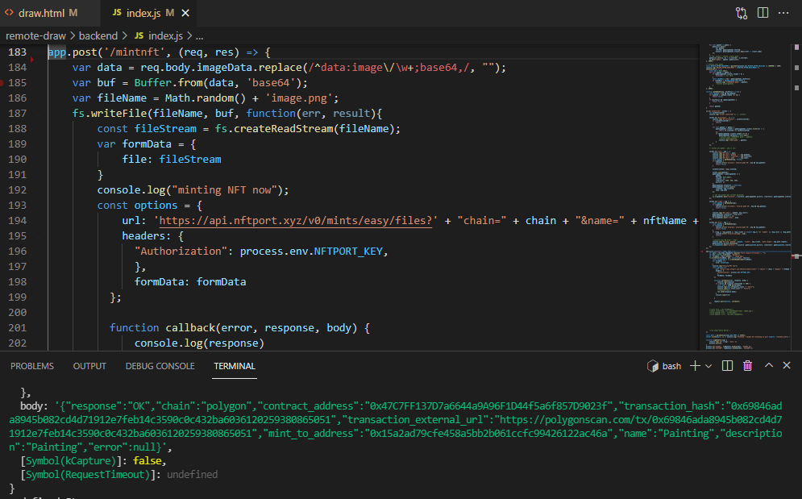

# NFToodle: Doodle together, have fun and sell as NFT!

Collaborative doodling and NFT minting. Try the demo here http://nftoodle.xyz/ .  

Built using NFTPort  https://www.nftport.xyz/ .  

Mouse + touch supported.  
Legacy browsers not supported.

  
  
  
  
  


## Dependencies
* Reverse Proxy: Caddy 2 https://caddyserver.com/
* Backend: Node.js 14 (version 12 probably also works)
* Messaging: https://socket.io/
* Server: https://github.com/expressjs/express
* UI: https://github.com/hustcc/timeago.js

# Usage
## Install dependencies
```sh
$ ./npm-ci.sh
```

## Run locally
Start the backend server (frontend included):

```sh
$ cd backend
backend$ npm start
```

Afterwards, open http://localhost:42024 to enter the "lobby".  
Open the website in multiple tabs to simulate multiple users.

## Run on linux
In addition to node server, start a proxy server so that socket.io can communicate.
